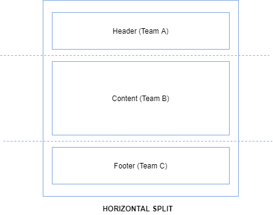
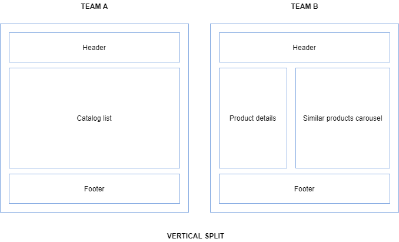
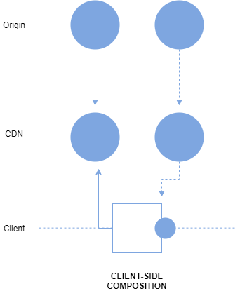
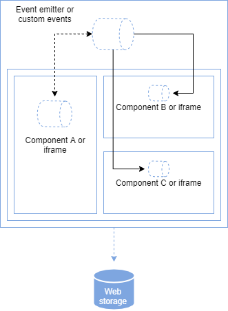
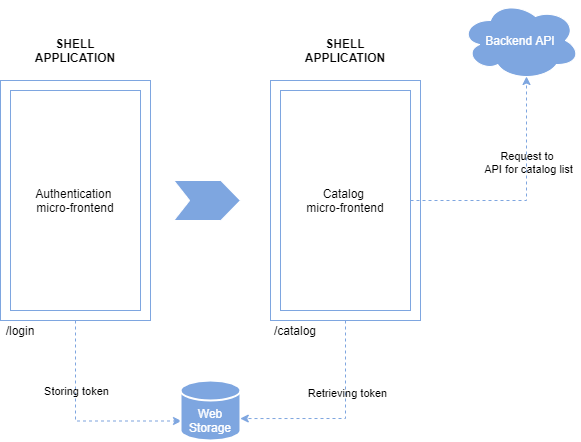

# atomic micro-frontends: A JavaScript library for building interfaces with vertical and horizontal micro-frontends

   

## 📄 Description

Atomic is a front-end library, based on iframes, that enables javascript developers to generate interfaces with vertical and horizontal micro-frontends from any framework-native using only client-side techniques and components based on Atomic Design.

## ✨ Features

* **Dependency Free**: Micro-frontends wrapped by Atomic don't need any extra library dependencies or configuration in their files to be used.
* **Shared Runtime**: Atomic Router provide a transition page option that is responsable for override temporarily pages that are loading micro-frontends, allowing it to show it content only when the micro-frontends are fully loaded and running at same time as a single product, keeping the UX intact.
* **Shared Context**: Atomic Pages provide a shared global object of context with all their micro-frontends, keeping a "single source of truth" concept for all of them.
* **Clean Communication**: Atomic embbed the entire shell application with a MessageEvent interceptor to properly deal with internal events (e.g., navigation and store), turning suh events more user friendly, and parse postMessage events (mostly provided by our micro-frontends) into actual CustomEvents, in order to turn their event listener declaration and data transfer object more semantic and synthetic for our app.
* **Atomic Design Components**: Atomic provide your own component abstraction to build our pages. Distributed as atoms, molecules, organisms, templates and pages, they are following the Atomic Design methology creating a merge of thoughts for the application composition and re-use of elements between the front-end and UX / UI teams.

## 📚 Examples

### Atomicfy

Atomicfy is a Spotify clone that was built with Atomic, using micro-frontends from Vue.js, React.js, Angular 9 and Svelte. If you got any curiosity about how was made, please check our [repository link](https://github.com/aacgn/atomicfy).

## 🔎 Atomic Micro-Frontends Concepts

Before start building our own application, it's important to understand some basic principles of micro-frontend architecture.

### Definition

The first one it's the definition. You can define the micro-frontends architecture in two ways: horizontal, which allows multiple micro-frontends per page; and vertical, which allows one micro-frontend per business domain.





Opting for a horizontal design means you’ll split a view into multiple parts, which may or may not be owned by the same team. The challenge is to ensure that these different parts have a cohesive look and feel. Bear in mind that with this approach, we’re breaking one of the first principles we’ve defined for micro-frontends: model around a business domain. (Though I’d also say it’s hard to consider a footer a business domain!)

Opting for vertical splitting means you’ll look at the same problem from a business rather than a technical point of view. You’ll assign each business domain, such as authentication UI or the catalog UI, to a team. This enables each team to become domain experts—which, as I noted earlier, is especially valuable when teams have more agency to employ that expertise. In fact, each domain team, despite how many views the domain is composed of, can operate with full autonomy.

Of the two, vertical splitting is closest to the traditional SPA or server-side rendering approach. It doesn’t heavily fragment the implementation, and each team truly owns a specific area of the application.

### Composition



Atomic uses a client-side composition. That architecture can be defined by the usage of an application shell to load multiple micro-frontends directly from a CDN (or from the origin if the micro-frontend is not yet cached at the CDN level), often with JavaScript or an HTML file as the micro-frontends’ entry point. This way, the application shell can dynamically append the DOM nodes (in the case of an HTML file) or initialize the JavaScript application (if the entry point is a JavaScript file).

It’s also possible to use a combination of iframes to load different micro-frontends, **which is the exatcly case of Atomic solution**.

### Routing

As with compositions, Atomic choose a client-side architecture.

The client-side routing, in which an app shell contains and loads the micro-frontends, is mainly used when you’ve sliced your applications vertically, so that the app shell loads one micro-frontend at a time instead of a multitude at once. If you’re using a horizontal split, you should have a page—a container like the app shell—that contains the different micro-frontends. By changing the URL, you can load a different page with a different view.

### Communication between micro-frontends

If you’ve opted for a horizontal split, your next step is to define how your micro-frontends communicate with each other. One method is to use an event emitter injected into each micro-frontend. This would make each micro-frontend totally unaware of its fellows, and make it possible to deploy them independently. When a micro-frontend emits an event, the other micro-frontends subscribed to that specific event react appropriately.

You can also use custom events. These have to bubble up to the window level in order to be heard by other micro-frontends, which means that all micro-frontends are listening to all events happening within the window object. They also dispatch events directly to the window object, or bubble the event to the window object, in order to communicate.





If you’re working with a vertical split, you’ll need to understand how to share information across micro-frontends. For both horizontal and vertical approaches, think about how views communicate when they change. It’s possible that variables may be passed via query string, or by using the URL to pass a small amount of data (and forcing the new view to retrieve some information from the server). Alternatively, you can use web storage to temporarily (session storage) or permanently (local storage) store the information to be shared with other micro-frontends.

> **Note**: Most of the micro-frontend concepts presented into "How Atomic Works" section, was extract from the article "Micro-frontends in context" wrote by Luca Mezzalira (@lucamezzalira). If you want to learn more this topic, please take a look at the full content of paper using this [link](https://increment.com/frontend/micro-frontends-in-context/#authors).

## 🌞 Usage

### Boiler template

Atomic has a boiler template available with webpack, webpack-dev-server and babel already configured in our [atomic-template](https://github.com/aacgn/atomic-template) repository. Please, starting using it for new projects.

### Documentation

#### Atomic

```javascript
import { Atomic } from "@aacgn/atomic";
import Router from "./router";

import "./global.css";

new Atomic(Router, document.getElementById("root"));
```

Atomic is also know as the application manager, it responsability is provide communication and integration between every piece of the library. Beyond link the Atomic Router to a start redenring point, as can be easily predicted by their parameters, it's main job is intercepting MessageEvents with the attribute "hasAtomicSignature" setted as true and properly treating them based on their message content (that, by the way, will be explained in the next section).

##### MessageEvent interceptor

As previously mentioned, Atomic main job is to intecept MessageEvents with the attribute "hasAtomicSignature" setted as true and properly treating them based on their message content. But, what you don't know it's how you can use it.

In the current version, we have three public funcionalities:

* navigate: Responsible for link you to another page
* store: Reponsible for update the data of global context store
* custom_event: Reponsible for transform MessageEvent into a CustomEvent

To use them, you must first define a object with following attributes:

* hasAtomicSignature: A bool field that is reponsible for enable or disable the interception of Atomic in this event
* event: A string field that is reponsible for identify the public functionality that you wanna use
* data: A object field that store and pass the a needed information of the public functionality that you wanna use

After that, you must pass this object through a window.postMessage method and are done.

Just to make sure that you gonna do right in your first time, I gonna provide some examples in the content bellow:

```javascript
const postMessageData = {
    hasAtomicSignature: true,
    event: "navigate",
    data: "/"
};

window.postMessage(postMessageData, "*");
```

```javascript
const postMessageData = {
    hasAtomicSignature: true,
    event: "store",
    data: {
        name: "login",
        data: {
            oAuthToken: {}
        }
    }
};

window.postMessage(postMessageData, "*");
```

```javascript
const postMessageData = {
    hasAtomicSignature: true,
    event: "custom_event",
    data: {
        name: "hello",
        data: {
            message: "Hello, Antonio Neto. How are you?"
        }
    }
};

window.postMessage(postMessageData, "*");
```

#### Atomic Router

```javascript
import { AtomicRouter } from "@aacgn/atomic";

import LoginPage from "../pages/LoginPage";
import DashboardPage from "../pages/DashboardPage";

import TransitionPage from "../pages/TransitionPage";

const routes = [
    {
        path: "/",
        page: LoginPage()
    },
    {
        path: "/dashboard",
        page DashboardPage()
    }
]

const Router = new AtomicRouter(
    {
        routes: routes,
        mode: "history",
        transitionPage: TransitionPage()
    }
);

export default Router;
```

Atomic Router is the responsible for controling what is being displayed in the screen and. With it you can define routes, mode, and a transition page that is gonna be used when micro-frontends wrapped into a page are loading.

##### Routes

Routes it's a array of object where the user will declare and structure the URL paths, controling when and what your application will render.

Currently, our inner array object have only two attributes that must be passed:

* Path: Conditional URL path location where your page will be rendered.
* Page: Component that your router is gonna display when the path setted be reached.

For example, in the code bellow our application will render the DashboardPage component when the URL path location reach "dashboard". Depending on the mode of routing you choosed, your URL path will be something like this: http://localhost:8888/dashboard or http://localhost:8888/#/dashboard.

```javascript
const routes = [
    {
        path: "/",
        page: LoginPage()
    },
    {
        path: "/dashboard",
        page DashboardPage()
    }
]
```

##### Mode

Mode it's related with how your URL paths will work. Currently, you can choose between two modes:

* History
* Hash

In general scenarios, hash and history can be used, unless you care more about the appearance. # Symbols in URLs do not look very beautiful.

With History, we use conventional address bar URL. For example, this URL: http://www.abc.com/hello. The value of path is /hello.

> **Note**: If you gonna use history mode, please, remember to set your server with historyApiFallback.

With Hash, we use in the address bar URL along side withs # symbols. For example, this URL: http://www.abc.com/#/hello. The value of hash is #/hello。The feature is that although hash appears in the URL, it will not be included in the HTTP request and has no effect on the back end, so changing hash will not reload the page.

##### Transition Page

The trasition page option was developed to temporarily override a page that must be render when a micro-frontend wrapper are being loaded, that way we can provide a experience of single product, keeping the UX intact.

#### Components

Components are the responsible for translate our javascript objects into actually DOM elements for our browser pages. Currently, they can be split in the following types:

* Atoms
* Molecules
* Organisms
* Templates
* Micro-frontends Wrapper
* Pages

All of them follows the Atomic Design methodology and have a unique reponsability, along side with our own properties to be declared and used in the library.

#### Atoms

Atoms are the basic building blocks of matter. Applied to web interfaces, atoms are our HTML tags, such as a form label, an input or a button.

We can use it in Atomic as the following implementation:

```javascript

import { createAtom } from "@aacgn/atomic";

import "./index.css";

const BaseButton = (textContent) => createAtom({
    tag: "button",
    attr: {
        className: "base-button"
    },
    props: {
        textContent: textContent
    }
});

export default BaseButton;

```

#### Molecules

Things start getting more interesting and tangible when we start combining atoms together. Molecules are groups of atoms bonded together and are the smallest fundamental units of a compound. These molecules take on their own properties and serve as the backbone of our design systems.

We can use it in Atomic as the following implementation:

```javascript

import { createMolecule } from "@aacgn/atomic";

import BaseInput from "./BaseInput";
import BaseButton from  "./BaseButton";

import "./index.css";

const SearchField = () => createMolecule({
    tag: "div",
    attr: {
        className: "search-field"
    },
    props: {
        children: [
            BaseInput("Enter Keyword"),
            BaseButton("Search")
        ]
    }
});

export default SearchField;

```

#### Organisms

Molecules give us some building blocks to work with, and we can now combine them together to form organisms. Organisms are groups of molecules joined together to form a relatively complex, distinct section of an interface.


We can use it in Atomic as the following implementation:

```javascript

import { createOrganism } from "@aacgn/atomic";

import Logo from "./Logo";
import NavBar from "./NavBar";
import SearchField from "./SearchField";

import "./index.css";

const TopBar = () => createOrganism({
    tag: "div",
    attr: {
        className: "top-bar"
    },
    props: {
        children: [
            Logo(),
            NavBar(["Home", "About", "Blog", "Contact"]),
            SearchField()
        ]
    }
});

export default TopBar;

```

#### Templates

At the template stage, we break our chemistry analogy to get into language that makes more sense to our clients and our final output. Templates consist mostly of groups of organisms stitched together to form pages. It’s here where we start to see the design coming together and start seeing things like layout in action.


We can use it in Atomic as the following implementation:

```javascript

import { createTemplate } from "@aacgn/atomic";

import TopBar from "./TopBar";
import CatalogCarousel from "./CatalogCarousel";
import CatalogRecommendation from "./CatalogRecommendation";

import "./index.css";

const DashboardTemplate = (carouselItems, recommendationItems) => createTemplate({
    tag: "div",
    attr: {
        className: "dashboard"
    },
    props: {
        children: [
            TopBar(),
            CatalogCarousel(carouselItems),
            CatalogRecommendation(recommendationItems)
        ]
    }
});

export default DashboardTemplate;

```

#### Pages

Pages are specific instances of templates. Here, placeholder content is replaced with real representative content to give an accurate depiction of what a user will ultimately see.

```javascript

import { createPage } from "@aacgn/atomic";

import DashboardTemplate from "./DashboardTemplate";

import "./index.css";

const DashboardPage = () => createPage({
    name: "dashboard",
    context: {
        carouselItems: [],
        recommendationItems: []
    },
    mount: function() {
        return DashboardTemplate(this.context.carouselItems, this.content.recommendationItems);
    },
    onMount: function(ref) {
        console.log('hello');
    },
    onUnmount: function(ref) {
        console.log('bye');
    }
});

export default DashboardPage;
```

### Micro-frontends Wrapper

Finally, we came to our last component. It responsability is insert the micro-frontend from any framework-native in our pages.They doesn't have any hierarchy level and can be called in any of level of atomic design, the only restriction it's be a child of a page.

Going to a more pratice way, imagine that everything exemplified previously until template as putted into a micro-frontend, the following example bellow will demonstrate how wrap that and use into our page.

DashboardMicroFrontendWrapper
```javascript
import { createMicroFrontendWrapper } from "@aacgn/atomic";

import "./index.css";

const DashboardMicroFrontendWrapper = () => createMicroFrontendWrapper({
    attr: {
        className: "dashboard-micro-frontend-wrapper"
    },
    props: {
        url: "http://localhost:3000"
    }
});

export default DashboardMicroFrontendWrapper;
```

DashboardPage
```javascript

import { createPage } from "@aacgn/atomic";

import DashboardMicroFrontendWrapper from "./DashboardMicroFrontendWrapper";

import "./index.css";

const DashboardPage = () => createPage({
    name: "dashboard",
    context: {
        carouselItems: [],
        recommendationItems: []
    },
    mount: function() {
        return DashboardMicroFrontendWrapper();
    },
    onMount: function(ref) {
        console.log('hello');
    },
    onUnmount: function(ref) {
        console.log('bye');
    }
});

export default DashboardPage;
```

> **Note**: If you wanna catch the context object inside our micro-frontends use window.AtomicContextStore['name-of-your-page'] in it or just send the data through postMessage such as postMessage.


### Auxiliar functions

Atomic also provide for it's shell application a couple of auxiliar functions. Currently, they are:

* dispatchEvent: Responsible for send events to micro-frontends declared into our application.
* navigateTo: Reponsible for redirect our application to another path
* storeData: Responsible for storage data into a context store item
* mapContextStore: Responsible for return all context store object

Examples:

```javascript
import { dispatchEvent } from "@aacgn/atomic";

dispatchEvent("carouselItems", 12, ["dashboard-micro-frontend-wrapper"]);
``` 

```javascript
import { navigateTo } from "@aacgn/atomic";

navigateTo("/");
``` 

```javascript
import { storeData } from "@aacgn/atomic";

storeData("dashboard", {carouselItems: [], recommendationItems: []});
``` 

```javascript
import { mapContextStore } from "@aacgn/atomic";

mapContextStore("dashboard");
``` 


## 👪 Contributing
Pull requests are welcome. For major changes, please open an issue first to discuss what you would like to change.

Please make sure to update tests as appropriate.

## 📃 License

```LICENSE
MIT License

Copyright (c) 2020 Antonio Neto

Permission is hereby granted, free of charge, to any person obtaining a copy
of this software and associated documentation files (the "Software"), to deal
in the Software without restriction, including without limitation the rights
to use, copy, modify, merge, publish, distribute, sublicense, and/or sell
copies of the Software, and to permit persons to whom the Software is
furnished to do so, subject to the following conditions:

The above copyright notice and this permission notice shall be included in all
copies or substantial portions of the Software.

THE SOFTWARE IS PROVIDED "AS IS", WITHOUT WARRANTY OF ANY KIND, EXPRESS OR
IMPLIED, INCLUDING BUT NOT LIMITED TO THE WARRANTIES OF MERCHANTABILITY,
FITNESS FOR A PARTICULAR PURPOSE AND NONINFRINGEMENT. IN NO EVENT SHALL THE
AUTHORS OR COPYRIGHT HOLDERS BE LIABLE FOR ANY CLAIM, DAMAGES OR OTHER
LIABILITY, WHETHER IN AN ACTION OF CONTRACT, TORT OR OTHERWISE, ARISING FROM,
OUT OF OR IN CONNECTION WITH THE SOFTWARE OR THE USE OR OTHER DEALINGS IN THE
SOFTWARE.
```
